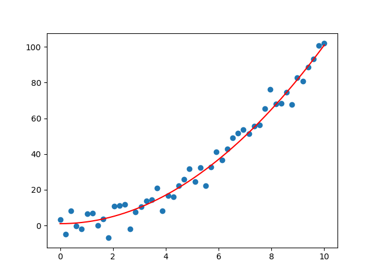
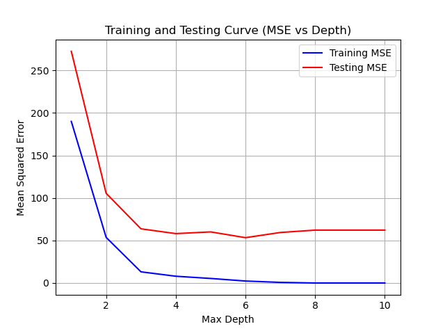
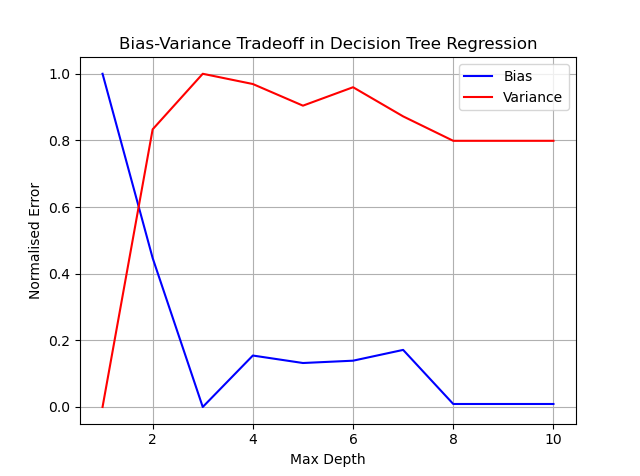

The bias and variance vs complexity (depth) is calculated and plot is plotted for Classification and Regression Dataset.

Data has been generated in the following ways:

For Regression:
```python:
x = np.linspace(0, 10, 50)
eps = np.random.normal(0, 5, 50)
```

Tha calculation of Bias and Variance has been referred from [here](http://rasbt.github.io/mlxtend/user_guide/evaluate/bias_variance_decomp/)

Depths varied from 1 to 10 and the results are as follows:

Dataset:



Regression:



