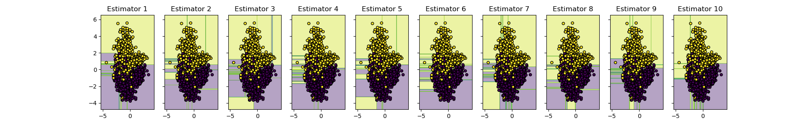
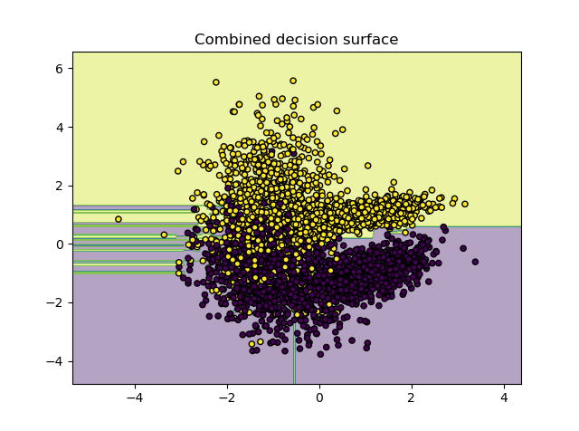
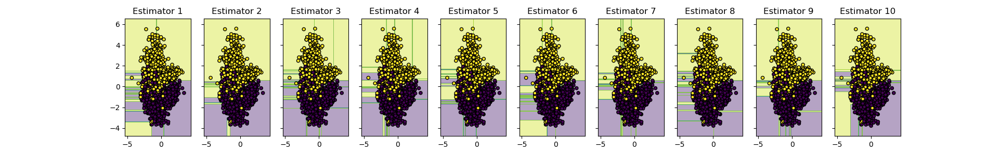
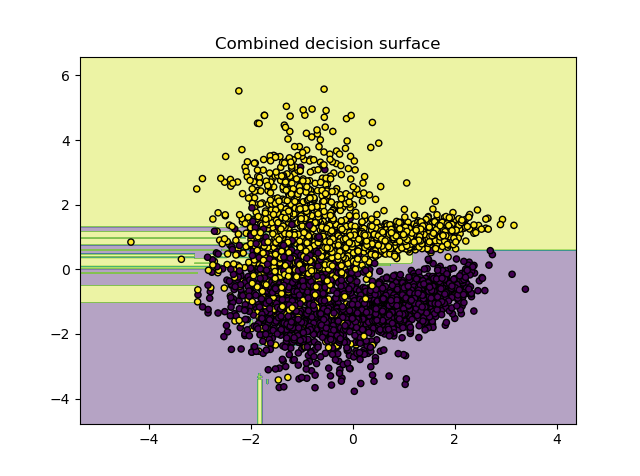

Bagging has been implemneted and tested using q4_Bagging.py
The following are the results:

```
Accuracy Squencial : 0.95175
Time Squencial : 0.0735 seconds
```




```
Accuracy Parallel : 0.9515
Time Parallel : 0.0385 seconds
```





