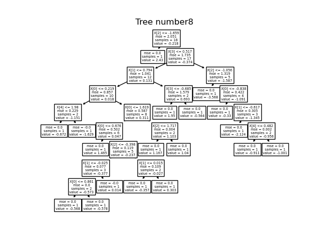
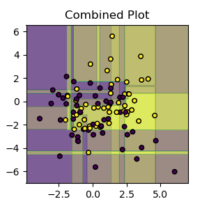

## Q5. a
Random forest is implemented using sklearn Decision trees and is updated in `tree/randomForest.py`

The implementation is tested against `q5_RandomForest.py` and the results are as follows:
```
Criteria : information_gain
Accuracy:  93.33333333333333
Class:  0
Precision:  90.0
Recall:  100.0
Class:  3
Precision:  100.0
Recall:  85.71428571428571
Class:  2
Precision:  100.0
Recall:  85.71428571428571
Class:  4
Precision:  80.0
Recall:  100.0
Class:  1
Precision:  100.0
Recall:  100.0

Criteria : gini_index
Accuracy:  96.66666666666667
Class:  0
Precision:  100.0
Recall:  88.88888888888889
Class:  3
Precision:  100.0
Recall:  100.0
Class:  2
Precision:  87.5
Recall:  100.0
Class:  4
Precision:  100.0
Recall:  100.0
Class:  1
Precision:  100.0
Recall:  100.0
Criteria : gini_index
RMSE:  0.6644085768340983
MAE:  0.49385394601750776
```

The plots of trees are as follows:


Classification:


Regression:





## Q5. b
Classification data iris data is taken for plotting random forest. Two features are drawn for each decision surface and plots are as follows:



